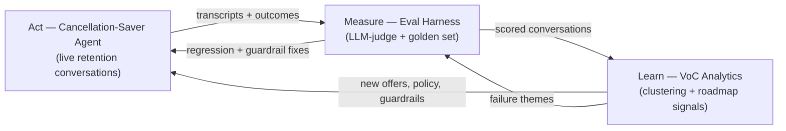
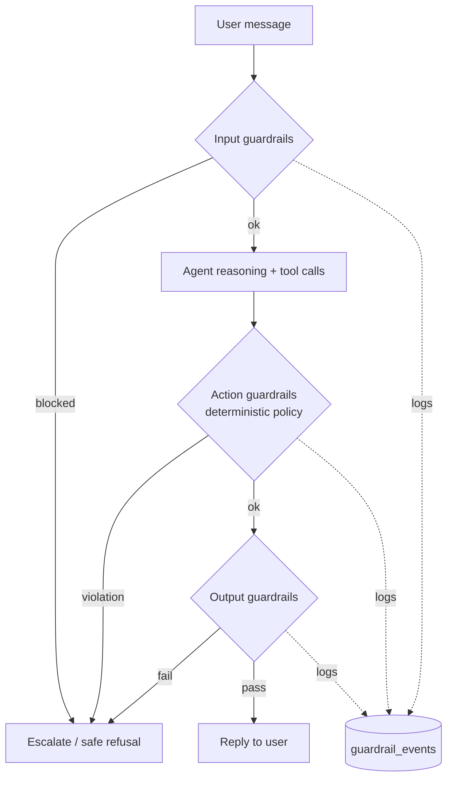

# Retention Flywheel — Build Plan

*A single platform combining a cancellation-saver agent (#2), a self-grading eval harness (#5), and voice-of-customer analytics (#19), built on the OpenAI API — with agent safety guardrails and EU-regulatory compliance designed in from the start.*

Working name: **Keel** — the part of a ship that keeps it from drifting. (Fits the Sierra/Bret-Taylor nautical vibe, and the metaphor writes itself in an interview: it's what keeps customers from drifting away.)

*Last updated: 17 July 2026. Regulatory dates reflect the EU AI Act as amended by the Digital Omnibus (final Council green light 29 June 2026).*

---

## 0. Operating principles

The tool is built from these principles; every design decision below traces back to one. The first four are the founding intent; the rest are what keep an autonomous, customer-facing agent from failing the way the market's incumbents do.

1. **Simple to use and manage.** One person can run it. Configuration is legible; changes don't require a vendor.
2. **Biased to the next best action.** Always move the conversation toward resolution — propose and act, don't stall.
3. **Calibrated autonomy.** Freedom to act scales with the reversibility and confidence of the action: low-risk, reversible, high-confidence → it acts; high-stakes, irreversible, or low-confidence → it proposes and a human confirms. *This is the rule that lets "autonomous" and "human-in-the-loop" coexist instead of competing.*
4. **Legible, not just autonomous.** Every decision is inspectable and explainable in plain language — the basis for real oversight and for trust after the first mistake.
5. **Fails safe.** Under uncertainty it defers or escalates rather than guessing fluently, and prefers reversible actions so mistakes stay cheap.
6. **Measured, and self-improving.** It grades its own work and compounds over time. ROI is *proven* by this loop, not asserted.
7. **Economic from day one, outcome-honest.** ROI-positive on the first use case, optimized on a metric it cannot game (margin-adjusted save rate, never vanity numbers).
8. **Fast to first value.** Days to a live, measurable win — not months. (This is the exact gap the incumbents leave open.)
9. **Meets the stack where it is.** Composable with the customer's existing CRM, billing, and tools rather than a rebuild.

---

## 1. Why these three belong in one product

Most "AI agent" demos stop at the agent. The reason this combination is worth building is that the three pieces close a loop that a single agent never can:

- **Act (#2 — Cancellation-Saver):** runs the live retention conversation. Detects churn intent, picks the right retention move within policy, and records an outcome (saved / lost / escalated).
- **Measure (#5 — Eval Harness):** grades *every* conversation the agent has — resolution, policy adherence, offer appropriateness, tone, and hallucination — with an LLM-as-judge plus a golden-set regression suite.
- **Learn (#19 — VoC Analytics):** clusters the graded conversations into themes to surface *why* customers churn, *which* offers actually retain them (and at what margin cost), and *where* the agent is failing — then turns that into ranked roadmap signals.

The output of Learn becomes the input to Act (new offers, updated policy, new guardrails), and the output of Measure tells you whether those changes helped. That's the flywheel. Building the loop — not just the agent — is the thing that reads as *platform* product thinking.

---

## 2. Market context — why this loop matters commercially

The category leader validates the direction. Sierra raised a $950M Series E in May 2026 at ~$15.8B (led by GV and Tiger Global), on ARR that went from ~$26M (end 2024) to ~$200M (May 2026), serving 40%+ of the Fortune 50. So enterprises are clearly buying CX agents.

But the recurring criticisms of Sierra and its peers are *not* "the agent can't talk." They are: deployments take months, ROI is hard to prove, changes need the vendor's team, and agents occasionally misbehave (a coordinated jailbreak hit a dozen-plus customer agents; a misconfigured guardrail let Gap's agent answer off-scope questions). Every one of those is a **measurement, governance, or safety** problem — i.e., the exact layers this platform adds around the agent. Building the loop is a direct answer to the market's actual open problems, which is why it's the strongest possible portfolio signal for an Agent-Development / Forward-Deployed PM role.

---

## 3. Architecture

Five services, deliberately small so the whole thing runs on a laptop.

**a. Conversation runtime (the agent).** OpenAI Responses API with tool calling. Tools are deterministic Python functions the model may call: `get_customer`, `get_subscription`, `get_usage`, `offer_discount`, `offer_pause`, `downgrade_plan`, `escalate_to_human`. The final turn returns a **structured disposition** (JSON schema): `{ intent, churn_reason, offer_made, offer_accepted, outcome, confidence }`.

**b. Policy / guardrail layer.** A deterministic wrapper *around* the model (detailed in §4). The LLM proposes; this layer disposes.

**c. Eval service.** LLM-as-judge scoring each conversation against a rubric (structured output: per-dimension 1–5 + rationale + pass/fail verdict), plus a hand-labeled **golden set** run on every prompt change to catch regressions, with judge-vs-human agreement tracked so the eval itself stays calibrated.

**d. Analytics service.** `text-embedding-3-small` over conversation summaries → clustering (k-means or HDBSCAN) → per-cluster LLM summarization into a **theme card** (`label, summary, size, save_rate, avg_margin_cost, top_example_ids`) → ranked roadmap signals by volume × loss-impact.

**e. Dashboard + synthetic data engine.** A thin UI (Streamlit fastest; Next.js if you want it to look real) showing live conversations, eval scores, save-rate, guardrail trips, and theme cards. A **synthetic customer generator** (idea #16, doing double duty) produces realistic personas + churn reasons to drive the loop and to serve as the adversarial test set.

**Data model (SQLite is plenty):** `customers`, `subscriptions`, `conversations` (transcript, disposition, outcome), `evals` (scores JSON, verdict, rationale), `guardrail_events` (type, action, conversation_id), `themes`, `signals`, plus `audit_log` (see §5).

---

## 4. Agent safety & guardrails

Guardrails are not a prompt instruction ("please don't do X") — they are enforced layers the model cannot talk its way past. Design as **defense-in-depth**: independent checks at input, output, and action, each fail-closed.

**Input guardrails (before the model acts).**
- *Prompt-injection / jailbreak detection* — screen user input for override attempts ("ignore your instructions", role-play escapes). Directly targets the coordinated-jailbreak failure mode. Use a moderation/classifier pass plus known-pattern heuristics.
- *Scope / off-topic detection* — a lightweight classifier confirms the message is in the retention/CX domain; out-of-scope input gets a bounded response, not a free-form answer. This is the Gap.com off-scope failure, prevented.
- *PII / sensitive-data detection* — flag and redact card numbers, health data, credentials before anything is logged or embedded.

**Action guardrails (the deterministic policy layer — the most important).**
- *Authorization limits* — max discount depth, margin floors, eligibility rules (e.g., no second save-offer within 90 days). The model may *propose* `offer_discount(30%)`; the policy layer caps or rejects it.
- *Human-in-the-loop for consequential actions* — any action with a significant or legal effect on the customer (denying a refund, changing contract terms, anything credit/eligibility-related) requires human approval. This is both good safety and a GDPR Art. 22 requirement (see §5).
- *Tool sandboxing* — tools operate only on the authenticated customer's own records; no cross-account access.

**Output guardrails (before the reply is sent).**
- *Grounding / hallucination check* — verify claims about the customer's account trace to actual tool results; block invented facts.
- *Promise / commitment check* — ensure the reply doesn't commit to anything the action layer didn't authorize.
- *Tone & brand-safety filter* — moderation pass for harmful, discriminatory, or off-brand content.

**Program-level safety.**
- *Adversarial red-teaming* — the synthetic engine generates jailbreak and social-engineering attempts; track a **guardrail catch rate** as a first-class metric.
- *Full observability* — every guardrail trip is logged to `guardrail_events`, scored by the eval layer, and surfaced in analytics, so "where is the agent unsafe" becomes a theme card, not a surprise.
- *Kill switch & fallback* — a global flag that drops the agent to safe-mode (disclosure + human handoff) if catch rates or eval scores breach a threshold.

The elegant part: the guardrail layer, the eval layer, and the analytics layer are the *same* observability spine viewed three ways — enforce, score, aggregate.

---

## 5. EU regulatory compliance (AI Act + GDPR)

Sierra operates across the EU (London, Paris, Madrid, Munich), and a customer-facing retention agent processing EU residents' data is squarely in scope. Designing for this is a differentiator, not overhead — and the current timeline makes it concrete.

**Risk classification (task-based, not tech-based).** Under the AI Act, an agent's risk tier follows its *function*. A retention/CX agent that answers questions and makes bounded offers is a **limited-risk** system — its main obligation is transparency (below). It becomes **high-risk** only if it moves into an Annex III task — e.g., preparing or assisting **creditworthiness, insurance pricing/eligibility, or access to essential services** decisions. That matters here: the moment this loop is pointed at a lender, insurer, or health plan (exactly Sierra's Rocket Mortgage / SoFi / Chime / Blue Shield customers), it can cross into high-risk and pull in the full regime.

**What's binding, and when (as of July 2026):**
- **Article 50 transparency — applies 2 August 2026 (imminent, unchanged by the Omnibus).** People must be told they're interacting with AI unless it's obvious. *Build:* a mandatory disclosure at conversation start ("You're chatting with an AI agent…"), enforced as an input-side guardrail so it can never be skipped.
- **High-risk obligations — deferred to 2 December 2027** for Annex III stand-alone systems (was Aug 2026); embedded/Annex I to 2 August 2028, per the Digital Omnibus. So if you extend into a high-risk domain, the heavy obligations (risk management, data governance, logging, human oversight, conformity assessment) have a runway — but design toward them now.
- **Bias monitoring — now extended to all AI systems**, not just high-risk, under the Omnibus. Your eval layer should include a fairness slice.
- **AI literacy (Art. 4)** — already in force; staff supervising the agent must be trained. Trivial for a POC; note it.

**GDPR (applies regardless of AI Act tier):**
- **Art. 22 — no solely-automated decisions with legal/significant effects.** Consequential outcomes (refund denial, contract change, eligibility) need meaningful human review + a right to explanation. This is why the action-layer human-in-the-loop exists.
- **Data minimization & purpose limitation** — the analytics layer is the risk here: **pseudonymize/redact PII before embedding and clustering**, set retention limits, and keep a documented lawful basis. Clustering on de-identified summaries, not raw transcripts.
- **Traceability** — keep an `audit_log` of decisions and guardrail events (also pre-builds the high-risk record-keeping obligation).

**Compliance-by-design mapping (what you can say in an interview):**

| Obligation | Where it's handled in Keel |
|---|---|
| AI Act Art. 50 — AI disclosure (2 Aug 2026) | Mandatory disclosure turn, enforced as input guardrail |
| GDPR Art. 22 — human review of significant decisions | Action-layer human-in-the-loop for consequential tools |
| Data minimization / purpose limitation | PII redaction before logging + embedding; de-identified clustering |
| Bias monitoring (all systems, per Omnibus) | Fairness slice in the eval rubric |
| Traceability / record-keeping (high-risk runway) | `audit_log` + `guardrail_events` |
| Human oversight (Art. 14, if high-risk) | Escalation path + kill switch already built |

Bottom line: this isn't a system that needs compliance *bolted on* — the transparency turn, the human-in-the-loop, the redaction step, and the audit log are the same components that make it safe and measurable.

---

## 6. Visualization layer — the insight surface

The analytics layer is only worth building if a product team can *read* it in ten seconds. The dashboard is designed form-first (the data's job picks the chart, color comes last) and ships colorblind-safe, light/dark, with a table view behind every chart. A rendered mockup accompanies this plan.

**What each view shows, and why that form:**

- **Hero + KPI row.** The one number the dashboard leads with is **margin-adjusted save rate** (hero figure, ≥48px) — deliberately *not* raw save rate, so the org can never celebrate a number it bought with margin. Around it, a row of stat tiles (save rate, eval pass rate, guardrail catch rate, compliance coverage), each with a signed delta vs. last period and a sparkline. A headline number is a *figure*, not a one-bar chart.
- **Save-rate vs. margin-adjusted trend** — a two-series line chart over time. The *gap between the two lines is the story*: it's the margin you're spending to retain. Legend + direct end-labels + hover crosshair; both series validated colorblind-safe.
- **Top churn drivers** (#19's core output) — a ranked horizontal bar, sequential single-hue (magnitude, not identity). Values at the tips; hover for the save-rate within each theme. This is the roadmap signal made legible.
- **Offer effectiveness** — a scatter of **save rate (y) vs. margin cost (x)**, one labeled point per offer. This is the single most decision-useful view: it shows at a glance that "20%-off" buys the highest save rate but sits far right on cost, while "pause" clusters top-left (cheap and effective). The tradeoff *is* the geometry.
- **Safety & compliance panel** — a guardrail **catch-rate meter** (same-ramp track, severity fill) and a **compliance-coverage meter** (should read 100%), plus stat tiles for guardrail events (jailbreaks blocked, off-scope bounded, over-limit rejected, PII redactions). Meters, not pies, for a single ratio against a limit.

**Accessibility / rigor (what to say about it):** the categorical palette was validated with a CVD/contrast script rather than eyeballed (worst adjacent colorblind ΔE well above the safe floor in both light and dark), identity never rests on color alone (legend + direct labels + a table view), and dark mode is a purpose-stepped palette, not an automatic invert. That level of care on a *mockup* is itself a PM signal — it says you sweat the surface where insight actually gets consumed.

---

## 7. OpenAI pieces to showcase

Tool/function calling (agent actions) · structured outputs / JSON schema (dispositions, eval verdicts) · Responses API (multi-turn state) · Moderation API (input/output guardrails) · embeddings (analytics clustering) · LLM-as-judge / Evals (measurement + bias slice) · prompt caching + Batch API (cost control when re-scoring thousands of conversations — name cost-per-conversation as a metric).

---

## 8. Metrics (the dashboard's north stars)

- **Save rate** and, more importantly, **margin-adjusted save rate** — saves you didn't over-discount to get.
- **Eval pass rate** + hallucination rate.
- **Judge calibration** — auto-eval vs. human agreement on the golden set.
- **Guardrail catch rate** — % of adversarial/off-scope attempts correctly blocked (safety KPI).
- **Insight latency** — time from a new churn theme appearing to it surfacing in analytics.
- **Compliance coverage** — % of conversations with disclosure present + audit record complete (should be 100%).

---

## 9. Unit economics — cost to serve, and the levers

Two lenses, both in the accompanying interactive calculator: **customer ROI** (does the buyer make money?) and **vendor unit economics** (does the service make money on each save?). Prices below are current OpenAI rates as of July 2026 and are editable in the calculator — the *structure* is the point, not the exact cents.

**Cost to serve, per conversation.** Decompose it, because the shape is the insight:

| Component | Model / basis | ≈ cost / conversation |
|---|---|---|
| Agent reasoning | flagship (GPT-5 $1.25/$10 per 1M), multi-turn, prompt-cached | ~$0.030 |
| Input + output guardrails | moderation (free) + small mini classifier | ~$0.001 |
| Eval (LLM-judge, 100% graded) | mini (GPT-5 mini $0.25/$2 per 1M) | ~$0.002 |
| Embedding / analytics | text-embedding-3-small ($0.02/1M) | ~$0.00001 |
| **Automated subtotal** | | **~$0.033** |
| Human escalation | escalation rate × cost per escalation | **25% × $5 = $1.25** |
| **Blended total** | | **~$1.28** |

**The headline result: ~97% of blended cost is human escalation, not tokens.** The entire AI stack — agent, guardrails, grading every conversation, embedding every conversation — costs about 3 cents. That reframes the whole optimization problem: the economic lever is **containment** (safely reducing escalation), *not* model choice, and you should **grade and analyze 100% of conversations** because measurement is nearly free. Sampling to "save money" saves nothing and costs you signal.

**Cost per save** = cost per conversation ÷ save rate → $1.28 ÷ 0.40 ≈ **$3.20**.

**Value / revenue per save:**
- *Customer view:* saved LTV (ARPU × retained months × margin) − offer cost, e.g. $300 − $40 = **$260 net**.
- *Vendor view (outcome-based, à la Sierra):* a fee per successful save, e.g. **$15**. Gross margin = ($15 − $3.20) / $15 ≈ **79%**.

**Ratios to watch:** cost per save · gross margin per save (vendor) · ROI multiple (customer = net value ÷ cost, ~80× here) · break-even save rate · contribution margin.

**Tuning levers — each trades something:**
1. **Offer generosity** ↑ → save rate ↑ but net value per save ↓. This is precisely what *margin-adjusted save rate* governs — there's an optimum, not "more is better."
2. **Escalation threshold** ↓ (contain more) → cost ↓, but the marginal contained conversation is harder to save; the guardrails are what let you contain *safely*.
3. **Model tiering** (mini for triage, flagship for hard cases) → cuts the automated portion ~5–10× — but that portion is already ~3 cents, so it's low-leverage. Don't over-engineer it.
4. **Eval sampling** → negligible savings; keep at 100%.
5. **Outcome fee** (vendor pricing lever) → the calculator shows break-even fee and margin.

**Worked monthly example (defaults):** 100k conversations, 40% save → 40k saves. Cost ≈ $128k. At a $15/save fee → $600k revenue, ~$472k gross profit (~79% margin). The customer meanwhile retains 40k × $260 ≈ $10.4M of value for their $600k fee — roughly a 17× return. That two-sided math is why outcome-based retention agents are a genuinely good business.

**The two swing variables are human-escalation cost and saved LTV** — not token prices. If you only instrument two numbers precisely, instrument those.

---

## 10. Milestones

Roughly 2–3 focused weeks; each phase ends in something demoable.

**Phase 0 — Scaffold (½ day).** Repo, SQLite schema (incl. `guardrail_events`, `audit_log`), synthetic customer generator.

**Phase 1 — Cancellation-Saver (2–3 days).** Agent with tools + structured disposition, plus the AI-disclosure turn from day one. *Demo:* saves an eligible customer, lets an ineligible one churn.

**Phase 2 — Guardrails & compliance (2 days).** Input/action/output guardrail layers, human-in-the-loop for consequential actions, PII redaction, audit logging. *Demo:* a jailbreak attempt blocked; an off-scope question bounded; an over-limit discount rejected.

**Phase 3 — Eval Harness (2 days).** LLM-judge rubric (incl. fairness slice) + golden-set regression. *Demo:* every conversation scored; break the prompt and watch the golden set catch it.

**Phase 4 — VoC Analytics (2 days).** De-identified embed → cluster → theme cards → ranked signals. *Demo:* "Top 3 churn drivers" and "20%-off saves 8% more than pause but costs 3× the margin."

**Phase 5 — Close the loop (1–2 days).** Dashboard uniting all layers; act on one insight, show the measured lift on the next batch. *The money demo — the flywheel visibly turning.*

**Phase 6 — Stretch.** A/B offer testing, adversarial red-team suite, and a "propose a policy change" agent that drafts the next guardrail from the analytics.

---

## 11. Risks / judgment calls (name these — they're PM signal)

Judge reliability (mitigate with the calibrated golden set) · over-optimizing raw save rate (why margin-adjusted exists) · cluster instability (fix seed/count before trusting trends) · guardrails that over-block and hurt UX (tune against the catch-rate/false-positive trade-off) · regulatory scope creep (staying limited-risk vs. tipping into high-risk the moment you touch credit/insurance/health).

---

## 12. How to frame it for the job hunt

Ship three artifacts: the one-line pitch + flywheel diagram; a recorded dashboard demo of the loop turning; and a one-page write-up of your north-star metric choice, your hardest judgment call (eval calibration), and your safety/compliance design.

The pitch: *"An AI retention agent that saves cancellations, grades itself on every conversation, tells the product team what to build next — and is safe and EU-AI-Act-compliant by design."* That last clause is what separates you from every candidate who only built a chatbot: you understood that in this market the hard, valued problems are **measuring, governing, and legally shipping** the agent — which is precisely the job.
